## Lab1: Explore a BigQuery Public Dataset
[source](https://googlecoursera.qwiklabs.com/focuses/11593489?parent=lti_session)

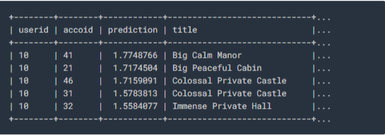

### Task 1. Query a public dataset
Load the USA Names dataset

### Query the USA Names dataset

  SELECT name, gender, SUM(number) AS total
  FROM `bigquery-public-data.usa_names.usa_1910_2013`
  GROUP BY name, gender
  ORDER BY total DESC
  LIMIT 10
 
 
### Task 2. Create a custom table
Download the data to your local computer

### Task 3. Create a dataset
babynames

### Task 5. Query the table

SELECT
 name, count
FROM
 `babynames.names_2014`
WHERE
 gender = 'M'
ORDER BY count DESC LIMIT 5

***

## Lab2: Recommend products using Cloud SQL and SparkML
[source](https://googlecoursera.qwiklabs.com/focuses/11593594?parent=lti_session)

### Task 1. Create a Cloud SQL instance
instancerentalsb.1

### Task 2. Create tables

CREATE DATABASE IF NOT EXISTS recommendation_spark;

USE recommendation_spark;

DROP TABLE IF EXISTS Recommendation;
DROP TABLE IF EXISTS Rating;
DROP TABLE IF EXISTS Accommodation;

CREATE TABLE IF NOT EXISTS Accommodation
(
  id varchar(255),
  title varchar(255),
  location varchar(255),
  price int,
  rooms int,
  rating float,
  type varchar(255),
  PRIMARY KEY (ID)
);

CREATE TABLE  IF NOT EXISTS Rating
(
  userId varchar(255),
  accoId varchar(255),
  rating int,
  PRIMARY KEY(accoId, userId),
  FOREIGN KEY (accoId)
    REFERENCES Accommodation(id)
);

CREATE TABLE  IF NOT EXISTS Recommendation
(
  userId varchar(255),
  accoId varchar(255),
  prediction float,
  PRIMARY KEY(userId, accoId),
  FOREIGN KEY (accoId)
    REFERENCES Accommodation(id)
);

SHOW DATABASES;

### Connect to this instance
Public IP address
34.67.191.189
Connection name
qwiklabs-gcp-00-0081b145c400:us-central1:rentals

Connect using Cloud Shell:
`gcloud sql connect rentals --user=root --quiet`

`gcloud auth login`
https://accounts.google.com/o/oauth2/auth?client_id=32555940559.apps.googleusercontent.com&redirect_uri=urn%3Aietf%3Awg%3Aoauth%3A2.0%3Aoob&scope=openid+https%3A%2F%2Fww
w.googleapis.com%2Fauth%2Fuserinfo.email+https%3A%2F%2Fwww.googleapis.com%2Fauth%2Fcloud-platform+https%3A%2F%2Fwww.googleapis.com%2Fauth%2Fappengine.admin+https%3A%2F%2Fwww
.googleapis.com%2Fauth%2Fcompute+https%3A%2F%2Fwww.googleapis.com%2Fauth%2Faccounts.reauth&code_challenge=6ubIHps1lfIY5pLVRNs0OrThhVOkjrTfGrrYZuAQ7Ew&code_challenge_method=S
256&access_type=offline&response_type=code&prompt=select_account

`gcloud sql connect rentals --user=root --quiet`
pwd: xxx

mysql> SHOW DATABASES;

mysql> USE recommendation_spark;

SHOW TABLES;

mysql> SELECT * FROM Accommodation;

## Task 3. Stage data in Cloud Storage
* Option 1: Use the command line
On another cloud shell tab:

echo "Creating bucket: gs://$DEVSHELL_PROJECT_ID"
gsutil mb gs://$DEVSHELL_PROJECT_ID

echo "Copying data to our storage from public dataset"
gsutil cp gs://cloud-training/bdml/v2.0/data/accommodation.csv gs://$DEVSHELL_PROJECT_ID
gsutil cp gs://cloud-training/bdml/v2.0/data/rating.csv gs://$DEVSHELL_PROJECT_ID

echo "Show the files in our bucket"
gsutil ls gs://$DEVSHELL_PROJECT_ID

echo "View some sample data"
gsutil cat gs://$DEVSHELL_PROJECT_ID/accommodation.csv

* (OR) Option 2: Use the Cloud Console UI
[accommodation.csv](https://storage.googleapis.com/cloud-training/bdml/v2.0/data/accommodation.csv)
[rating](https://storage.googleapis.com/cloud-training/bdml/v2.0/data/rating.csv)

## Task 4. Load data from Cloud Storage into Cloud SQL tables

qwiklabs-gcp-00-0081b145c400/accommodation.csv
with [Your-Bucket-Name]= qwiklabs-gcp-00-0081b145c400

## Task 5. Explore Cloud SQL data

USE recommendation_spark;

mysql> SELECT * FROM Rating
LIMIT 15;

mysql> SELECT COUNT(*) AS num_ratings
FROM Rating;

mysql> SELECT
    COUNT(userId) AS num_ratings,
    COUNT(DISTINCT userId) AS distinct_user_ratings,
    MIN(rating) AS worst_rating,
    MAX(rating) AS best_rating,
    AVG(rating) AS avg_rating
FROM Rating;

mysql> SELECT
    userId,
    COUNT(rating) AS num_ratings
FROM Rating
GROUP BY userId
ORDER BY num_ratings DESC;

mysql> exit

## Task 6. Launch Dataproc

region of your Cloud SQL instance: us-central1-b

Name: , Zone and Total worker nodes in your cluster.

echo "Authorizing Cloud Dataproc to connect with Cloud SQL"
CLUSTER=rentals
CLOUDSQL=rentals
ZONE=us-central1-a
NWORKERS=2

machines="$CLUSTER-m"
for w in `seq 0 $(($NWORKERS - 1))`; do
   machines="$machines $CLUSTER-w-$w"
done

echo "Machines to authorize: $machines in $ZONE ... finding their IP addresses"
ips=""
for machine in $machines; do
    IP_ADDRESS=$(gcloud compute instances describe $machine --zone=$ZONE --format='value(networkInterfaces.accessConfigs[].natIP)' | sed "s/\['//g" | sed "s/'\]//g" )/32
    echo "IP address of $machine is $IP_ADDRESS"
    if [ -z  $ips ]; then
       ips=$IP_ADDRESS
    else
       ips="$ips,$IP_ADDRESS"
    fi
done

echo "Authorizing [$ips] to access cloudsql=$CLOUDSQL"
gcloud sql instances patch $CLOUDSQL --authorized-networks $ips

## Task 7. Run the ML model

gsutil cp gs://cloud-training/bdml/v2.0/model/train_and_apply.py train_and_apply.py
cloudshell edit train_and_apply.py

# MAKE EDITS HERE
CLOUDSQL_INSTANCE_IP = '<paste-your-cloud-sql-ip-here>'   # <---- CHANGE (database server IP)
CLOUDSQL_DB_NAME = 'recommendation_spark' # <--- leave as-is
CLOUDSQL_USER = 'root'  # <--- leave as-is
CLOUDSQL_PWD  = '<type-your-cloud-sql-password-here>'  # <---- CHANGE

gsutil cp train_and_apply.py gs://$DEVSHELL_PROJECT_ID

## Task 8. Run your ML job on Dataproc

Task 9. Explore inserted rows with SQL

## Lab3: Predict Visitor Purchases with a Classification Model with BigQuery ML
[source](https://googlecoursera.qwiklabs.com/focuses/11952773?parent=lti_session)

Once BigQuery is open, open on the below direct link in a new browser tab to bring the public data-to-insights project into your BigQuery projects panel:
https://console.cloud.google.com/bigquery?p=data-to-insights&d=ecommerce&t=web_analytics&page=table

The field definitions for the data-to-insights ecommerce dataset are here:
https://support.google.com/analytics/answer/3437719?hl=en

### Task 1. Explore ecommerce data

*Scenario*: Your data analyst team exported the Google Analytics logs for an ecommerce website into BigQuery and created a new table of all the raw ecommerce visitor session data for you to explore. Using this data, you'll try to answer a few questions.

**Question**: Out of the total visitors who visited our website, what % made a purchase?

#standardSQL
WITH visitors AS(
SELECT
COUNT(DISTINCT fullVisitorId) AS total_visitors
FROM `data-to-insights.ecommerce.web_analytics`
),

purchasers AS(
SELECT
COUNT(DISTINCT fullVisitorId) AS total_purchasers
FROM `data-to-insights.ecommerce.web_analytics`
WHERE totals.transactions IS NOT NULL
)

SELECT
  total_visitors,
  total_purchasers,
  total_purchasers / total_visitors AS conversion_rate
FROM visitors, purchasers

total_visitors:	
741721
total_purchasers:
20015
conversion_rate	:
0.026984540008979117

**Question**: What are the top 5 selling products?

SELECT
  p.v2ProductName,
  p.v2ProductCategory,
  SUM(p.productQuantity) AS units_sold,
  ROUND(SUM(p.localProductRevenue/1000000),2) AS revenue
FROM `data-to-insights.ecommerce.web_analytics`,
UNNEST(hits) AS h,
UNNEST(h.product) AS p
GROUP BY 1, 2
ORDER BY revenue DESC
LIMIT 5;

**Question**: How many visitors bought on subsequent visits to the website?

# visitors who bought on a return visit (could have bought on first as well
WITH all_visitor_stats AS (
SELECT
  fullvisitorid, # 741,721 unique visitors
  IF(COUNTIF(totals.transactions > 0 AND totals.newVisits IS NULL) > 0, 1, 0) AS will_buy_on_return_visit
  FROM `data-to-insights.ecommerce.web_analytics`
  GROUP BY fullvisitorid
)

SELECT
  COUNT(DISTINCT fullvisitorid) AS total_visitors,
  will_buy_on_return_visit
FROM all_visitor_stats
GROUP BY will_buy_on_return_visit

Analyzing the results, you can see that (11873 / 729848) = 1.6% of total visitors will return and purchase from the website.

## Task 2. Select features and create your training dataset

Browse the complete list of fields here
https://support.google.com/analytics/answer/3437719?hl=en
and then preview the demo dataset
https://bigquery.cloud.google.com/table/data-to-insights:ecommerce.web_analytics?tab=preview
https://console.cloud.google.com/bigquery?utm_source=bqui&utm_medium=link&utm_campaign=classic&project=desire-e1b18

SELECT
  * EXCEPT(fullVisitorId)
FROM

  # features
  (SELECT
    fullVisitorId,
    IFNULL(totals.bounces, 0) AS bounces,
    IFNULL(totals.timeOnSite, 0) AS time_on_site
  FROM
    `data-to-insights.ecommerce.web_analytics`
  WHERE
    totals.newVisits = 1)
  JOIN
  (SELECT
    fullvisitorid,
    IF(COUNTIF(totals.transactions > 0 AND totals.newVisits IS NULL) > 0, 1, 0) AS will_buy_on_return_visit
  FROM
      `data-to-insights.ecommerce.web_analytics`
  GROUP BY fullvisitorid)
  USING (fullVisitorId)
ORDER BY time_on_site DESC
LIMIT 10;

*Discussion*: will_buy_on_return_visit is not known after the first visit. Again, you're predicting for a subset of users who returned to your website and purchased. Since you don't know the future at prediction time, you cannot say with certainty whether a new visitor come back and purchase. The value of building a ML model is to get the probability of future purchase based on the data gleaned about their first session.

**Question**: Looking at the initial data results, do you think time_on_site and bounces will be a good indicator of whether the user will return and purchase or not?

**Answer**: It's often too early to tell before training and evaluating the model, but at first glance out of the top 10 time_on_site, only 1 customer returned to buy, which isn't very promising. Let's see how well the model does.

## Task 3. Create a BigQuery dataset to store models

Create a new dataset: ecommerce

## Task 4. Select a BigQuery ML model type and specify options

CREATE OR REPLACE MODEL `ecommerce.classification_model`
OPTIONS
(
model_type='logistic_reg',
labels = ['will_buy_on_return_visit']
)
AS

#standardSQL
SELECT
  * EXCEPT(fullVisitorId)
FROM

  # features
  (SELECT
    fullVisitorId,
    IFNULL(totals.bounces, 0) AS bounces,
    IFNULL(totals.timeOnSite, 0) AS time_on_site
  FROM
    `data-to-insights.ecommerce.web_analytics`
  WHERE
    totals.newVisits = 1
    AND date BETWEEN '20160801' AND '20170430') # train on first 9 months
  JOIN
  (SELECT
    fullvisitorid,
    IF(COUNTIF(totals.transactions > 0 AND totals.newVisits IS NULL) > 0, 1, 0) AS will_buy_on_return_visit
  FROM
      `data-to-insights.ecommerce.web_analytics`
  GROUP BY fullvisitorid)
  USING (fullVisitorId)
;

## Task 5. Evaluate classification model performance

### Select your performance criteria
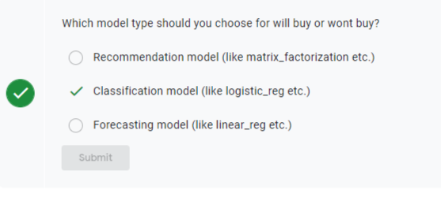

SELECT
  roc_auc,
  CASE
    WHEN roc_auc > .9 THEN 'good'
    WHEN roc_auc > .8 THEN 'fair'
    WHEN roc_auc > .7 THEN 'not great'
  ELSE 'poor' END AS model_quality
FROM
  ML.EVALUATE(MODEL ecommerce.classification_model,  (

SELECT
  * EXCEPT(fullVisitorId)
FROM

  # features
  (SELECT
    fullVisitorId,
    IFNULL(totals.bounces, 0) AS bounces,
    IFNULL(totals.timeOnSite, 0) AS time_on_site
  FROM
    `data-to-insights.ecommerce.web_analytics`
  WHERE
    totals.newVisits = 1
    AND date BETWEEN '20170501' AND '20170630') # eval on 2 months
  JOIN
  (SELECT
    fullvisitorid,
    IF(COUNTIF(totals.transactions > 0 AND totals.newVisits IS NULL) > 0, 1, 0) AS will_buy_on_return_visit
  FROM
      `data-to-insights.ecommerce.web_analytics`
  GROUP BY fullvisitorid)
  USING (fullVisitorId)

));

Row	roc_auc	model_quality
1	0.724588	not great

## Task 6. Improve model performance with feature engineering

### Add some new features and create a second machine learning model called `classification_model_2`

CREATE OR REPLACE MODEL `ecommerce.classification_model_2`
OPTIONS
  (model_type='logistic_reg', labels = ['will_buy_on_return_visit']) AS

WITH all_visitor_stats AS (
SELECT
  fullvisitorid,
  IF(COUNTIF(totals.transactions > 0 AND totals.newVisits IS NULL) > 0, 1, 0) AS will_buy_on_return_visit
  FROM `data-to-insights.ecommerce.web_analytics`
  GROUP BY fullvisitorid
)

# add in new features
SELECT * EXCEPT(unique_session_id) FROM (

  SELECT
      CONCAT(fullvisitorid, CAST(visitId AS STRING)) AS unique_session_id,

      # labels
      will_buy_on_return_visit,

      MAX(CAST(h.eCommerceAction.action_type AS INT64)) AS latest_ecommerce_progress,

      # behavior on the site
      IFNULL(totals.bounces, 0) AS bounces,
      IFNULL(totals.timeOnSite, 0) AS time_on_site,
      totals.pageviews,

      # where the visitor came from
      trafficSource.source,
      trafficSource.medium,
      channelGrouping,

      # mobile or desktop
      device.deviceCategory,

      # geographic
      IFNULL(geoNetwork.country, "") AS country

  FROM `data-to-insights.ecommerce.web_analytics`,
     UNNEST(hits) AS h

    JOIN all_visitor_stats USING(fullvisitorid)

  WHERE 1=1
    # only predict for new visits
    AND totals.newVisits = 1
    AND date BETWEEN '20160801' AND '20170430' # train 9 months

  GROUP BY
  unique_session_id,
  will_buy_on_return_visit,
  bounces,
  time_on_site,
  totals.pageviews,
  trafficSource.source,
  trafficSource.medium,
  channelGrouping,
  device.deviceCategory,
  country
);

### Evaluate this new model to see if there is better predictive power:

#standardSQL
SELECT
  roc_auc,
  CASE
    WHEN roc_auc > .9 THEN 'good'
    WHEN roc_auc > .8 THEN 'fair'
    WHEN roc_auc > .7 THEN 'not great'
  ELSE 'poor' END AS model_quality
FROM
  ML.EVALUATE(MODEL ecommerce.classification_model_2,  (

WITH all_visitor_stats AS (
SELECT
  fullvisitorid,
  IF(COUNTIF(totals.transactions > 0 AND totals.newVisits IS NULL) > 0, 1, 0) AS will_buy_on_return_visit
  FROM `data-to-insights.ecommerce.web_analytics`
  GROUP BY fullvisitorid
)

# add in new features
SELECT * EXCEPT(unique_session_id) FROM (

  SELECT
      CONCAT(fullvisitorid, CAST(visitId AS STRING)) AS unique_session_id,

      # labels
      will_buy_on_return_visit,

      MAX(CAST(h.eCommerceAction.action_type AS INT64)) AS latest_ecommerce_progress,

      # behavior on the site
      IFNULL(totals.bounces, 0) AS bounces,
      IFNULL(totals.timeOnSite, 0) AS time_on_site,
      totals.pageviews,

      # where the visitor came from
      trafficSource.source,
      trafficSource.medium,
      channelGrouping,

      # mobile or desktop
      device.deviceCategory,

      # geographic
      IFNULL(geoNetwork.country, "") AS country

  FROM `data-to-insights.ecommerce.web_analytics`,
     UNNEST(hits) AS h

    JOIN all_visitor_stats USING(fullvisitorid)

  WHERE 1=1
    # only predict for new visits
    AND totals.newVisits = 1
    AND date BETWEEN '20170501' AND '20170630' # eval 2 months

  GROUP BY
  unique_session_id,
  will_buy_on_return_visit,
  bounces,
  time_on_site,
  totals.pageviews,
  trafficSource.source,
  trafficSource.medium,
  channelGrouping,
  device.deviceCategory,
  country
)
));

`*This statement created a new model named qwiklabs-gcp-00-5c644c481577:ecommerce.classification_model_2.*

Model details
Model ID	
qwiklabs-gcp-00-5c644c481577:ecommerce.classification_model_2
Date created	
Oct 22, 2020, 5:09:41 PM
Model expiration	
Never
Date modified	
Oct 22, 2020, 5:09:41 PM
Data location	
US
Model type	
LOGISTIC_REGRESSION
Loss type	
Mean log loss
Training Data	
Temporary training data table
Evaluation Data	
Temporary evaluation data table
Training options
Max allowed iterations	
20
Actual iterations	
8
L1 regularization	
0.00
L2 regularization	
0.00
Early stop	
true
Min relative progress	
0.01
Learn rate strategy	
Line search
Line search initial learn rate	
0.10

Row	roc_auc	model_quality
1	0.910382	good

## Task 7. Predict which new visitors will come back and purchase

SELECT
*
FROM
  ml.PREDICT(MODEL `ecommerce.classification_model_2`,
   (

WITH all_visitor_stats AS (
SELECT
  fullvisitorid,
  IF(COUNTIF(totals.transactions > 0 AND totals.newVisits IS NULL) > 0, 1, 0) AS will_buy_on_return_visit
  FROM `data-to-insights.ecommerce.web_analytics`
  GROUP BY fullvisitorid
)

  SELECT
      CONCAT(fullvisitorid, '-',CAST(visitId AS STRING)) AS unique_session_id,

      # labels
      will_buy_on_return_visit,

      MAX(CAST(h.eCommerceAction.action_type AS INT64)) AS latest_ecommerce_progress,

      # behavior on the site
      IFNULL(totals.bounces, 0) AS bounces,
      IFNULL(totals.timeOnSite, 0) AS time_on_site,
      totals.pageviews,

      # where the visitor came from
      trafficSource.source,
      trafficSource.medium,
      channelGrouping,

      # mobile or desktop
      device.deviceCategory,

      # geographic
      IFNULL(geoNetwork.country, "") AS country

  FROM `data-to-insights.ecommerce.web_analytics`,
     UNNEST(hits) AS h

    JOIN all_visitor_stats USING(fullvisitorid)

  WHERE
    # only predict for new visits
    totals.newVisits = 1
    AND date BETWEEN '20170701' AND '20170801' # test 1 month

  GROUP BY
  unique_session_id,
  will_buy_on_return_visit,
  bounces,
  time_on_site,
  totals.pageviews,
  trafficSource.source,
  trafficSource.medium,
  channelGrouping,
  device.deviceCategory,
  country
)

)

ORDER BY
  predicted_will_buy_on_return_visit DESC;
  

  

**Results**
Of the top 6% of first-time visitors (sorted in decreasing order of predicted probability), more than 6% make a purchase in a later visit.
These users represent nearly 50% of all first-time visitors who make a purchase in a later visit.
Overall, only 0.7% of first-time visitors make a purchase in a later visit.
Targeting the top 6% of first-time increases marketing ROI by 9x vs targeting them all!

*Additional information*
`roc_auc` is just one of the performance metrics available during model evaluation. Also available are accuracy, precision, and recall. Knowing which performance metric to rely on is highly dependent on what your overall objective or goal is.

***

## Lab4: Creating a Streaming Data Pipeline for a Real-Time Dashboard with Dataflow
{source}(https://googlecoursera.qwiklabs.com/focuses/11954104?parent=lti_session)

Member: 352226779593-compute@developer.gserviceaccount.com
project-number: 352226779593
project name (or ID): qwiklabs-gcp-00-79a9cf382e91

### Task 1. Create a Pub/Sub topic and BigQuery dataset
**Option 1**: The command-line tool

bq mk taxirides

bq mk \
--time_partitioning_field timestamp \
--schema ride_id:string,point_idx:integer,latitude:float,longitude:float,\
timestamp:timestamp,meter_reading:float,meter_increment:float,ride_status:string,\
passenger_count:integer -t taxirides.realtime

**Option 2**: The BigQuery Console UI

ride_id:string,
point_idx:integer,
latitude:float,
longitude:float,
timestamp:timestamp,
meter_reading:float,
meter_increment:float,
ride_status:string,
passenger_count:integer

### Task 2. Create a Cloud Storage bucket

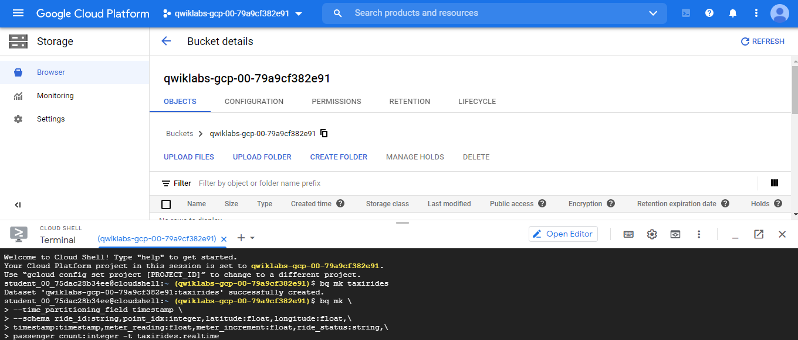

### Task 3. Set up a Dataflow Pipeline

*Input Pub/Sub topic*
projects/pubsub-public-data/topics/taxirides-realtime

*BigQuery output table*
qwiklabs-gcp-00-79a9cf382e91:taxirides.realtime

*Temporary location*
gs://qwiklabs-gcp-00-79a9cf382e91/tmp/

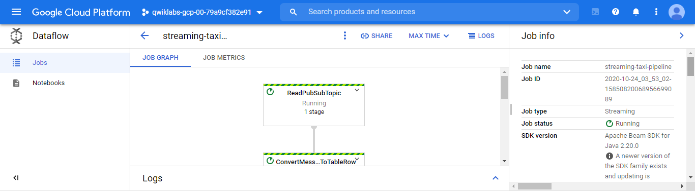

### Task 4. Analyze the taxi data using BigQuery

NYC data
https://data.cityofnewyork.us/browse?;sortBy=most_accessed&utf8=%E2%9C%93

SELECT * FROM taxirides.realtime LIMIT 10

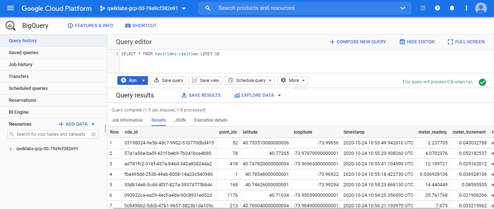

### Task 5. Perform aggregations on the stream for reporting

WITH streaming_data AS (

SELECT
  timestamp,
  TIMESTAMP_TRUNC(timestamp, HOUR, 'UTC') AS hour,
  TIMESTAMP_TRUNC(timestamp, MINUTE, 'UTC') AS minute,
  TIMESTAMP_TRUNC(timestamp, SECOND, 'UTC') AS second,
  ride_id,
  latitude,
  longitude,
  meter_reading,
  ride_status,
  passenger_count
FROM
  taxirides.realtime
WHERE ride_status = 'dropoff'
ORDER BY timestamp DESC
LIMIT 100000

)

# calculate aggregations on stream for reporting:
SELECT
 ROW_NUMBER() OVER() AS dashboard_sort,
 minute,
 COUNT(DISTINCT ride_id) AS total_rides,
 SUM(meter_reading) AS total_revenue,
 SUM(passenger_count) AS total_passengers
FROM streaming_data
GROUP BY minute, timestamp

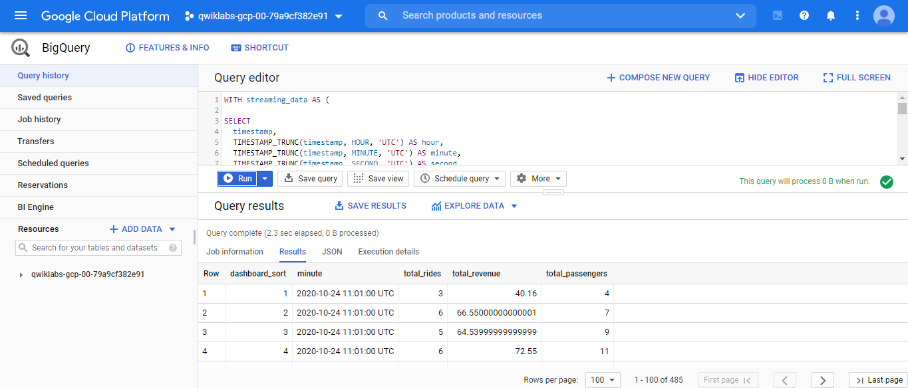

### Task 6. Create a real-time dashboard

https://datastudio.google.com/navigation/reporting

https://datastudio.google.com/u/0/explorer/ae74b7d6-5139-4315-867b-3ed268f5245b?config=%7B%22sql%22:%22WITH%20streaming_data%20AS%20(%5Cn%5CnSELECT%5Cn%20%20timestamp,%5Cn%20%20TIMESTAMP_TRUNC(timestamp,%20HOUR,%20%27UTC%27)%20AS%20hour,%5Cn%20%20TIMESTAMP_TRUNC(timestamp,%20MINUTE,%20%27UTC%27)%20AS%20minute,%5Cn%20%20TIMESTAMP_TRUNC(timestamp,%20SECOND,%20%27UTC%27)%20AS%20second,%5Cn%20%20ride_id,%5Cn%20%20latitude,%5Cn%20%20longitude,%5Cn%20%20meter_reading,%5Cn%20%20ride_status,%5Cn%20%20passenger_count%5CnFROM%5Cn%20%20taxirides.realtime%5CnWHERE%20ride_status%20%3D%20%27dropoff%27%5CnORDER%20BY%20timestamp%20DESC%5CnLIMIT%20100000%5Cn%5Cn)%5Cn%5Cn%23%20calculate%20aggregations%20on%20stream%20for%20reporting:%5CnSELECT%5Cn%20ROW_NUMBER()%20OVER()%20AS%20dashboard_sort,%5Cn%20minute,%5Cn%20COUNT(DISTINCT%20ride_id)%20AS%20total_rides,%5Cn%20SUM(meter_reading)%20AS%20total_revenue,%5Cn%20SUM(passenger_count)%20AS%20total_passengers%5CnFROM%20streaming_data%5CnGROUP%20BY%20minute,%20timestamp%22,%22billingProjectId%22:%22qwiklabs-gcp-00-79a9cf382e91%22,%22projectId%22:%22qwiklabs-gcp-00-79a9cf382e91%22,%22tableId%22:%22anonb3a6f30d_0200_4f58_98ba_0601ca8b8ae1%22,%22datasetId%22:%22_9e7cd014eb9a3c534f510fba14a8ca39a17c9e7a%22,%22connectorType%22:%22BIG_QUERY%22,%22sqlType%22:%22STANDARD_SQL%22%7D
Real-time-dashboard_v1

### Task 7. Create a time series dashboard

SELECT
  *
FROM
  taxirides.realtime
WHERE
  ride_status='dropoff'
  

project: qwiklabs-gcp-00-79a9cf382e91
  

**Create a time series chart **

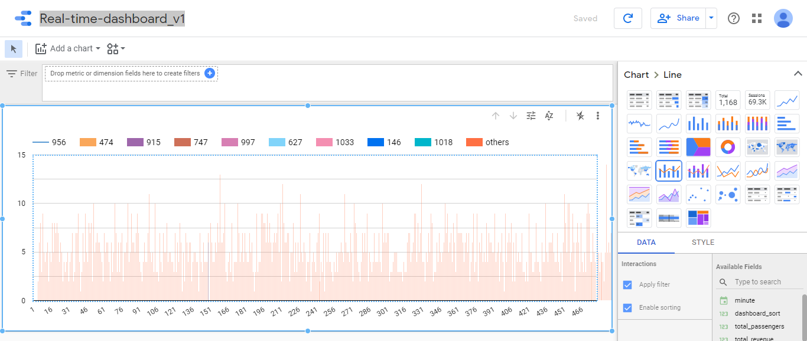

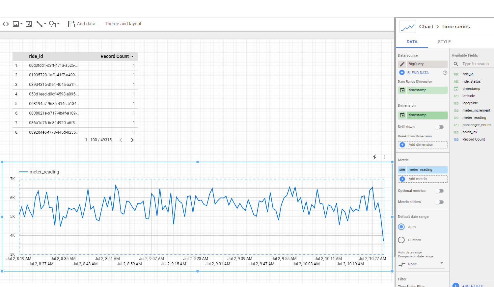

### Task 8. Stop the Dataflow job

***

## Lab5: Classifying Images of Clouds in the Cloud with AutoML Vision

### Task 1. Set up AutoML Vision

**Cloud AutoML API**
https://console.cloud.google.com/apis/library/automl.googleapis.com?q=Cloud%20AutoML%20API&id=1db466e2-eb92-4a12-8c6b-c31030d214f9&project=qwiklabs-gcp-01-151eaa31ecf5

**Create a Cloud Storage bucket for your training data**

gsutil mb -p $DEVSHELL_PROJECT_ID \
    -c regional    \
    -l us-central1 \
    gs://$DEVSHELL_PROJECT_ID-vcm/
	

*AutoML UI*
https://console.cloud.google.com/vision/datasets?project=qwiklabs-gcp-01-151eaa31ecf5&folder=&organizationId=

### Task 2. Upload training images to Cloud Storage

gsutil -m cp -r gs://automl-codelab-clouds/* gs://$DEVSHELL_PROJECT_ID-vcm/

gsutil ls gs://$DEVSHELL_PROJECT_ID-vcm/

**Optional**: View the images using the Cloud Storage Console UI

bucket-name: qwiklabs-gcp-01-151eaa31ecf5-vcm

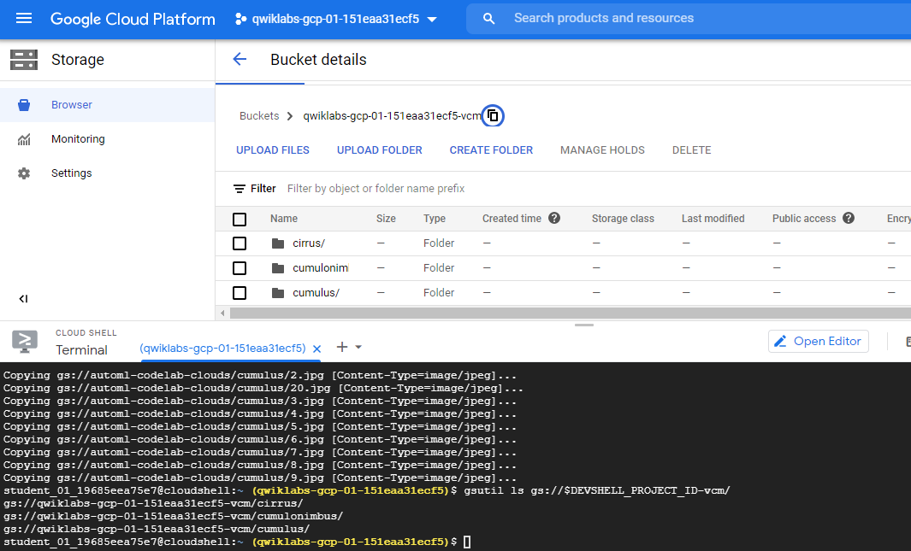

### Task 3. Create an AutoML Vision training dataset

gsutil cp gs://automl-codelab-metadata/data.csv .
head --lines=10 data.csv
sed -i -e "s/placeholder/$DEVSHELL_PROJECT_ID-vcm/g" ./data.csv
head --lines=10 data.csv
gsutil cp ./data.csv gs://$DEVSHELL_PROJECT_ID-vcm/
gsutil ls gs://$DEVSHELL_PROJECT_ID-vcm/

gsutil ls gs://$DEVSHELL_PROJECT_ID-vcm/*

gs://qwiklabs-gcp-01-151eaa31ecf5-vcm/data.csv
OR https://storage.cloud.google.com/qwiklabs-gcp-01-151eaa31ecf5-vcm/data.csv

### Task 4. Inspect the images

### Task 5. Train your model

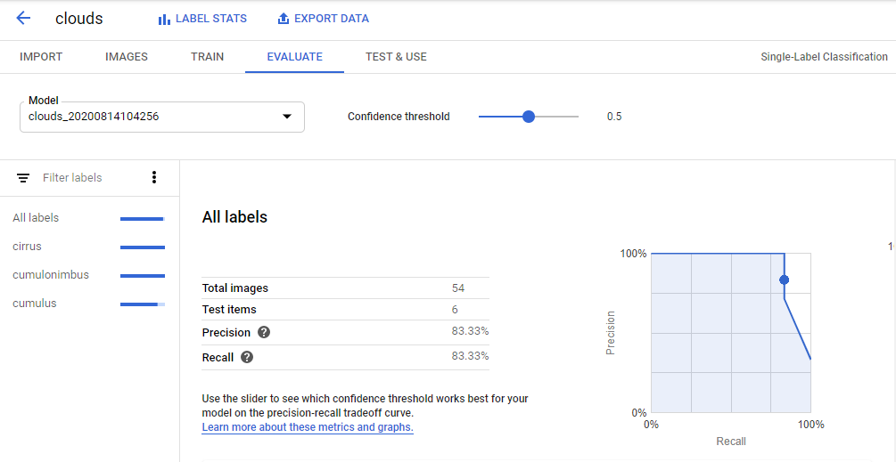

### Task 6. Evaluate your model

**Confusion matrix**
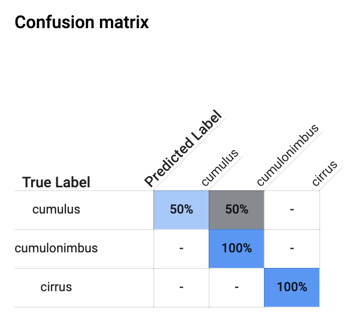

### Task 7. Generate predictions

***

